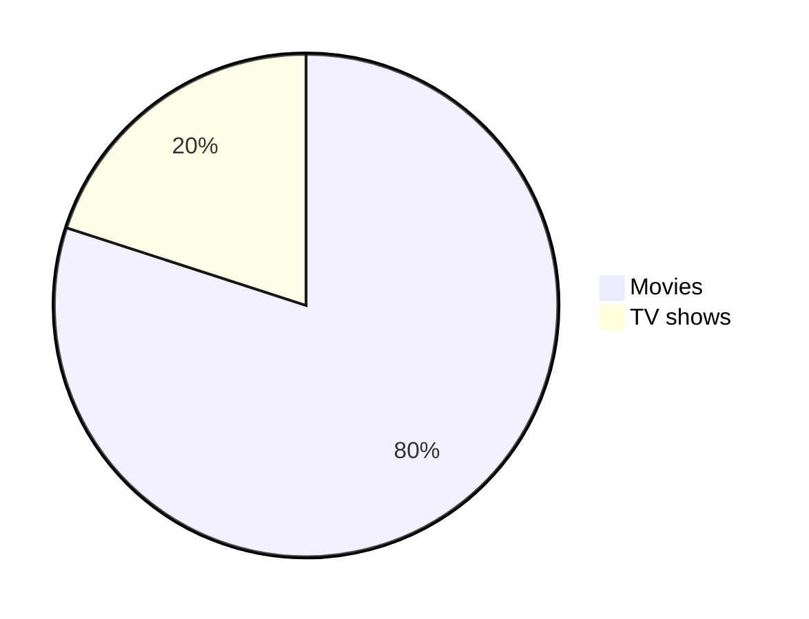

# ⚫️⚫️⚫️ LCM Markdown Cheat Sheet ⚫️⚫️⚫️

> [!IMPORTANT]
> Check out the official documentation on [GitHub](https://docs.github.com/en/get-started/writing-on-github/getting-started-with-writing-and-formatting-on-github/basic-writing-and-formatting-syntax) to learn more about writing and formatting syntax. Additionally, you can read the latest updates and features on Markdown by visiting the [GitHub blog](https://github.blog/tag/markdown/).

## Headings

```md
# Heading 1
## Heading 2
### Heading 3
#### Heading 4
##### Heading 5
###### Heading 6
```

## Table
```md
| Column  | Column  |
| ------- | ------- |
| Cell 11 | Cell 12 |
| Cell 21 | Cell 22 |
```

| Column  | Column  |
| ------- | ------- |
| Cell 11 | Cell 12 |
| Cell 21 | Cell 22 |

## Text styles
| Type of text           | Markdown                        | Output                                |
| ---------------------- | ------------------------------- | ------------------------------------- |
| Bold                   | `**bold**`                      | for **bold** text                     |
| Italic                 | `*italic*`                      | for _italic_ text                     |
| Bold and Italic        | `***bold and italic***`         | for **_bold and italic_** text        |
| Strikethrough          | `~~strikethrough~~`             | for ~~strikethrough~~ text            |
| Bold and nested italic | `**Bold and nested *italic* **` | for **Bold and nested _italic_** text |
| Subscript              | `<sub>subscript</sub>`          | for <sub>subscript</sub> text         |
| Superscript            | `<sup>superscript</sup>`        | for <sup>superscript</sup> text       |
| Underline              | `<ins>underline</ins>`          | for <ins>underline</ins> text         |

## Quotes
```md
> The quick brown fox jumps over the lazy dog.
>
> The quick brown fox jumps over the lazy dog.
>
> The quick brown fox jumps over the lazy dog.
```
> The quick brown fox jumps over the lazy dog.
>
> The quick brown fox jumps over the lazy dog.
>
> The quick brown fox jumps over the lazy dog.

## Multilevel Quotes
```md
> The quick brown fox jumps over the lazy dog.
>
> > The quick brown fox jumps over the lazy dog.
> >
> > > The quick brown fox jumps over the lazy dog.
```
> The quick brown fox jumps over the lazy dog.
>
> > The quick brown fox jumps over the lazy dog.
> >
> > > The quick brown fox jumps over the lazy dog.

## Check lists

```md
- [x] bread  
- [ ] milk  
- [x] eggs  
- [ ] teabags
```
- [x] bread  
- [ ] milk  
- [x] eggs  
- [ ] teabags

## Text Color
Using [MathJax](#mathematical-expressions-19-july-2022) syntax:

| Color Name  | Code                                                                          | Example                                                                     |
| ----------- | ----------------------------------------------------------------------------- | --------------------------------------------------------------------------- |
| Red     | `$\color{Red}{The\ quick\ brown\ fox\ jumps\ over\ the\ lazy\ dog.}$`     | $\color{Red}{The\ quick\ brown\ fox\ jumps\ over\ the\ lazy\ dog.}$     |
| Aquamarine  | `$\color{Aquamarine}{The\ quick\ brown\ fox\ jumps\ over\ the\ lazy\ dog.}$`  | $\color{Aquamarine}{The\ quick\ brown\ fox\ jumps\ over\ the\ lazy\ dog.}$  |
| Bittersweet | `$\color{Bittersweet}{The\ quick\ brown\ fox\ jumps\ over\ the\ lazy\ dog.}$` | $\color{Bittersweet}{The\ quick\ brown\ fox\ jumps\ over\ the\ lazy\ dog.}$ |
| Yellow       | `$\color{Yellow}{The\ quick\ brown\ fox\ jumps\ over\ the\ lazy\ dog.}$`       | $\color{Yellow}{The\ quick\ brown\ fox\ jumps\ over\ the\ lazy\ dog.}$       |


## Multiline
```md
The quick\
brown fox\
jumps over\
the lazy dog.
```
The quick
brown fox
jumps over
the lazy dog.


## Diff Code block

````md
```diff
## git diff a/test.txt b/test.txt
diff --git a/a/test.txt b/b/test.txt
index 309ee57..c995021 100644
--- a/a/test.txt
+++ b/b/test.txt
-The quick brown fox jumps over the lazy dog
+The quick brown fox jumps over the lazy cat
```
````
```diff
## git diff a/test.txt b/test.txt
diff --git a/a/test.txt b/b/test.txt
index 309ee57..c995021 100644
--- a/a/test.txt
+++ b/b/test.txt
-The quick brown fox jumps over the lazy dog
+The quick brown fox jumps over the lazy cat
```


## Alignments

```md
<p align="left">

</p>
```

<p align="left">
<!-- markdownlint-disable-next-line MD013 -->

</p>

```md
<p align="center">

</p>
```

<p align="center">
<!-- markdownlint-disable-next-line MD013 -->

</p>

```md
<p align="right">

</p>
```

<p align="right">
<!-- markdownlint-disable-next-line MD013 -->

</p>

```md
<h3 align="center"> My latest Medium posts </h3>
```

<!-- omit in toc -->

<h3 align="center"> My latest Medium posts </h3>

## Links

### Inline

```md
[The-Ultimate-Markdown-Cheat-Sheet](https://github.com/lifeparticle/Markdown-Cheatsheet)
```
[The-Ultimate-Markdown-Cheat-Sheet](https://github.com/lifeparticle/The-Ultimate-Markdown-Cheat-Sheet)
### Footnote

```md
Footnote.[^1]
Some other important footnote.[^2]
[^1]: This is footnote number one.
[^2]: Here is the second footnote.
```
Footnote.[^1]
Some other important footnote.[^2]
[^1]: This is footnote number one.
[^2]: Here is the second footnote.

### Relative
```md
[Example of a relative link](rl.md)
```
[Example of a relative link](rl.md)

### Auto
```md
Visit https://github.com/
```
Visit [https://github.com/](https://github.com/)

```md
Email at example@example.com
```
Email at example@example.com

### Enclosed

```md
<https://github.com/>
```

[https://github.com/](https://github.com/)

## Images
Alt text and title are optional.

```md

```


```md
![alt text][image]

[image]: https://images.unsplash.com/photo-1415604934674-561df9abf539?ixlib=rb-1.2.1&ixid=eyJhcHBfaWQiOjEyMDd9&auto=format&fit=crop&w=100&q=80 "Title text"

```
![alt text][image]

[image]: https://images.unsplash.com/photo-1415604934674-561df9abf539?ixlib=rb-1.2.1&ixid=eyJhcHBfaWQiOjEyMDd9&auto=format&fit=crop&w=100&q=80 "Title text"


### Group

#### Horizontal images

```md
<p>
  
  
  
</p>
```
<p>
  
  
  
</p>


#### Horizontal images with gap

```md
<p>
  
  
  
</p>
```
<p>
  
  
  
</p>


#### Vertical images
```md
<p>
  
  <br>
  
  <br>
  
</p>
```
<p>
  
  <br>
  
  <br>
  
</p>


#### Vertical images with gap
```md
<p>
  
  <br><br>
  
  <br><br>
  
</p>
```
<p>
  
  <br><br>
  
  <br><br>
  
</p>

## Badges
```md

```


## Videos

To embed a video in Markdown, you need to first upload the video file and then reference it inline:

[https://github.com/user-attachments/assets/90c624e0-f46b-47a7-8509-97585dc3688a](https://github.com/user-attachments/assets/90c624e0-f46b-47a7-8509-97585dc3688a)

```md
https://github.com/user-attachments/assets/90c624e0-f46b-47a7-8509-97585dc3688a
```

## Lists

### Ordered

Mac: <kbd>command+shift+7</kbd>

Windows: <kbd>control+shift+7</kbd>

```md
1. One
2. Two
3. Three
```

1. One
2. Two
3. Three

```md
1. First level
   1. Second level
      - Third level
        - Fourth level
2. First level
   1. Second level
3. First level
   1. Second level
```

1. First level
   1. Second level
      - Third level
        - Fourth level
2. First level
   1. Second level
3. First level
   1. Second level

### Unordered

Mac: <kbd>command+shift+8</kbd>

Windows: <kbd>control+shift+8</kbd>

```md
- 1
- 2
- 3

* 1
* 2
* 3

```

1. One
2. Two
3. Three


- 1
- 2
- 3

```md
- First level
  - Second level
    - Third level
      - Fourth level
- First level
  - Second level
- First level
  - Second level
```

- First level
  - Second level
    - Third level
      - Fourth level
- First level
  - Second level
- First level
  - Second level

```md
<ul>
<li>First item</li>
<li>Second item</li>
<li>Third item</li>
<li>Fourth item</li>
</ul>
```

<ul>
<li>First item</li>
<li>Second item</li>
<li>Third item</li>
<li>Fourth item</li>
</ul>

## Task

```md
- [x] Fix Bug 223
- [ ] Add Feature 33
- [ ] Add unit tests
```

- [x] Fix Bug 223
- [ ] Add Feature 33
- [ ] Add unit tests


## Horizontal Rule

```md
---
```
---


## Diagrams (19 July 2022)

````md

````


## Mathematical expressions (19 July 2022)

> [!IMPORTANT]
> Check out the official documentation on [GitHub](https://docs.github.com/en/get-started/writing-on-github/working-with-advanced-formatting/writing-mathematical-expressions) to learn more about writing and formatting MathJax syntax.

```md
This is an inline math expression $x = {-b \pm \sqrt{b^2-4ac} \over 2a}$
```

This is an inline math expression $x = {-b \pm \sqrt{b^2-4ac} \over 2a}$

```md
$$
x = {-b \pm \sqrt{b^2-4ac} \over 2a}
$$
```

$$
x = {-b \pm \sqrt{b^2-4ac} \over 2a}
$$

## Alerts (8 January 2024)

```md
> [!NOTE]
> Essential details that users should not overlook, even when browsing quickly.

<br>

> [!TIP]
> Additional advice to aid users in achieving better outcomes.

<br>

> [!IMPORTANT]
> Vital information required for users to attain success.

<br>

> [!WARNING]
> Urgent content that requires immediate user focus due to possible risks.

<br>

> [!CAUTION]
> Possible negative outcomes resulting from an action.
```

> [!NOTE]
> Essential details that users should not overlook, even when browsing quickly.

<br>

> [!TIP]
> Additional advice to aid users in achieving better outcomes.

<br>

> [!IMPORTANT]
> Vital information required for users to attain success.

<br>

> [!WARNING]
> Urgent content that requires immediate user focus due to possible risks.

<br>

> [!CAUTION]
> Possible negative outcomes resulting from an action.

## Mention people and teams

In issues:

```md
@lifeparticle
```

[Example shown in issue](https://github.com/lifeparticle/Markdown-Cheatsheet/issues/1)

In markdown file:

```md
https://github.com/lifeparticle
```

[https://github.com/lifeparticle](https://github.com/lifeparticle)

## Escaping Markdown Characters

- **Before escaping**

```md
- Asterisk
  \ Backslash
  ` Backtick
  {} Curly braces
  . Dot
  ! Exclamation mark

#### Hash symbol

- Hyphen symbol

() Parentheses

- Plus symbol

[] Square brackets
\_ Underscore`
```
- Asterisk
  \ Backslash
  ` Backtick
  {} Curly braces
  . Dot
  ! Exclamation mark

#### Hash symbol

- Hyphen symbol

() Parentheses

- Plus symbol

[] Square brackets
\_ Underscore`


- **After escaping**

```md
\* Asterisk
\\ Backslash
\` Backtick
\{} Curly braces
\. Dot
\! Exclamation mark
\# Hash symbol
\- Hyphen symbol
\() Parentheses
\+ Plus symbol
\[] Square brackets
\_ Underscore
```

\* Asterisk
\\ Backslash
\` Backtick
\{} Curly braces
\. Dot
\! Exclamation mark
\# Hash symbol
\- Hyphen symbol
\() Parentheses
\+ Plus symbol
\[] Square brackets
\_ Underscore
